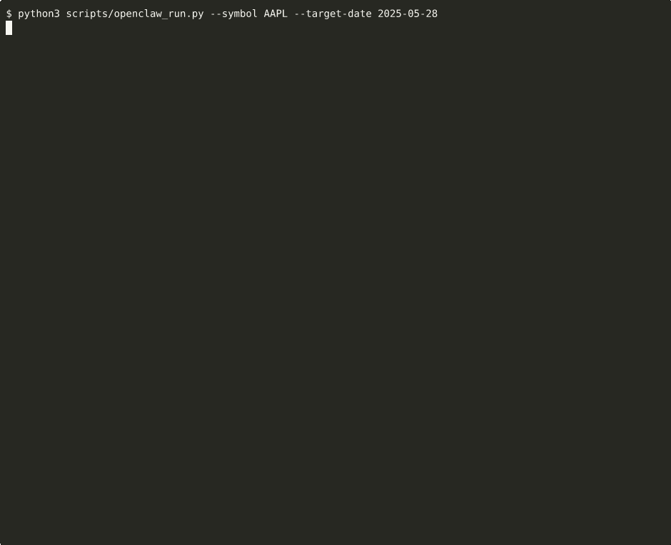

# Claude Agent Trading

Run the five `financial_agentic_benchmark` skills — **trading**, **hedging**, **report_generation**, **report_evaluation**, **auditing** — via the [Claude Agent SDK](https://docs.anthropic.com/en/docs/claude-code/agent-sdk).

Skills live under `.claude/skills/` and are auto-discovered by the SDK through `setting_sources=["project"]`; no manual registration is needed.

[中文文档 / Chinese version → README_ZH.md](README_ZH.md)

---

## Quick Start (Docker — recommended)

The Docker image bundles Python 3.12, the `claude` CLI, all Python dependencies, and a built-in `claude_proxy` that transparently routes Claude API calls to OpenAI / Gemini / Azure when your key is not `sk-ant-*`. You don't need to install anything on the host besides Docker.

```bash
# 1. Build the image once
./build_docker.sh

# 2. Run a task — pass host paths directly; the script auto-mounts them
export ANTHROPIC_API_KEY=sk-xxx                         # any provider key
export CLAUDE_MODEL=gpt-5.4                             # or claude-sonnet-4-6, etc.

./run_docker.sh trading --verbose \
    --symbol TSLA --start 2026-01-02 --end 2026-03-31 \
    --db-path ./env.duckdb \
    --output  ./results/trading
```

Output lands in `./results/trading/` on the host. A full run log is also written to `./results/trading/run_<UTC-timestamp>.log`.

See [Docker usage](#docker-usage) below for details.

---

## Native Install

```bash
pip install -r requirements.txt
```

Prerequisite: the `claude` CLI must be installed and on `PATH`.

Copy `.env.example` to `.env` and fill in credentials:

```bash
cp .env.example .env
```

| Environment variable | Description |
|----------------------|-------------|
| `ANTHROPIC_API_KEY` | Direct API authentication (native Anthropic, or any proxied provider key) |
| `ANTHROPIC_BASE_URL` | Custom API endpoint (proxy, OpenAI-compatible service, etc.) |
| `CLAUDE_MODEL` | Default model (defaults to `claude-sonnet-4-6`; CLI `--model` takes precedence) |
| `ANTHROPIC_FOUNDRY_RESOURCE` | Azure Foundry resource name |
| `ANTHROPIC_FOUNDRY_API_KEY` | Azure Foundry API key |
| `CLAUDE_CODE_USE_FOUNDRY` | Set to `1` to enable Foundry mode (all three Foundry vars required) |

Model resolution order: CLI `--model` > `CLAUDE_MODEL` env > default `claude-sonnet-4-6`.

`providers.py` automatically pins the main model to every alias (`ANTHROPIC_DEFAULT_HAIKU_MODEL`, `ANTHROPIC_DEFAULT_SONNET_MODEL`, `ANTHROPIC_DEFAULT_OPUS_MODEL`, `CLAUDE_CODE_SUBAGENT_MODEL`), so internal Claude CLI calls (compaction, title generation, sub-agents) all hit the same endpoint — critical when routing through a proxy to third-party APIs that don't recognize the built-in haiku/opus model names.

---

## Usage

### Single task

```bash
# trading — daily-loop skill over a date range, queries DuckDB via MCP
python run_benchmark.py trading \
    --symbol TSLA --start 2026-01-02 --end 2026-03-31 \
    --db-path  ./env.duckdb \
    --output   /path/to/results/trading

# report-generation — weekly-loop skill over a date range, queries DuckDB via MCP
python run_benchmark.py report-generation \
    --symbol TSLA --start 2026-01-02 --end 2026-03-31 \
    --db-path ./env.duckdb \
    --output  /path/to/results/report_generation

# report-evaluation — scores reports produced by report-generation
python run_benchmark.py report-evaluation \
    --benchmark-root /path/to/financial_agentic_benchmark \
    --ticker TSLA --target-agent codex --target-model gpt-5

# auditing — XBRL numeric fact audit
python run_benchmark.py auditing \
    --benchmark-root /path/to/financial_agentic_benchmark \
    --filing-name 10k --ticker rrr --issue-time 20231231 \
    --concept-id us-gaap:AssetsCurrent \
    --period "2023-01-01 to 2023-12-31" --case-id mr_1
```

### Batch

Prepare a JSONL file (one task per line, each including `benchmark_root`):

```jsonl
{"task_type":"report_generation","ticker":"TSLA","benchmark_root":"/path/to/financial_agentic_benchmark"}
{"task_type":"auditing","ticker":"rrr","filing_name":"10k","issue_time":"20231231","concept_id":"us-gaap:AssetsCurrent","period":"2023-01-01 to 2023-12-31","case_id":"mr_1","benchmark_root":"/path/to/financial_agentic_benchmark"}
```

Run:

```bash
python run_benchmark.py batch \
    --benchmark-root /path/to/financial_agentic_benchmark \
    --tasks-file tasks.jsonl
```

### Common options

| Option | Description |
|--------|-------------|
| `--model` | Override the default model |
| `--max-turns` | Agent turn cap (default 30, `trading` is per-day) |
| `--max-budget` | Cost cap in USD (`trading` default 1.0/day; others 5.0) |
| `--verbose` / `-v` | Print assistant text, thinking, and tool-use events to stderr |
| `--json` | Emit the final result as JSON |

---

## Docker usage

### Files

- `docker/Dockerfile` — Python 3.12-slim + Node 20 + `claude` CLI + all Python deps + tini
- `docker/entrypoint.sh` — runs inside the container; decides whether to start `claude_proxy` based on the API key, then `exec`s the benchmark CLI
- `.dockerignore` — excludes `.env`, results, and external benchmark data from the build context
- `run_docker.sh` — host-side launcher; auto-mounts path arguments, forwards env vars, runs as your UID/GID, and tees the full run log into `--output`
- `build_docker.sh` — one-line `docker build` wrapper

### Building

```bash
./build_docker.sh              # builds `trading-analysis:latest`
IMAGE=my-org/trading ./build_docker.sh   # custom tag
```

### Running

```bash
export ANTHROPIC_API_KEY=sk-xxx
export CLAUDE_MODEL=gpt-5.4                 # or claude-sonnet-4-6, gpt-4.1, etc.

./run_docker.sh trading --verbose \
    --symbol TSLA --start 2026-01-02 --end 2026-03-31 \
    --db-path ./env.duckdb \
    --output  ./results/trading
```

What `run_docker.sh` does for you:

1. **Auto path translation.** The following CLI arguments are recognized as host paths; `run_docker.sh` mounts them into the container and rewrites the argument to the in-container path, so you always pass host paths:

   | Category | Arguments | Mount mode |
   |----------|-----------|-----------|
   | Input directory | `--benchmark-root`, `--data-root`, `--reports-root` | `:ro` (mounted as-is) |
   | Input file | `--tasks-file` | `:ro` (parent directory mounted) |
   | DuckDB file | `--db-path` | `:rw` (parent directory; DuckDB needs to write the WAL) |
   | Output directory | `--output`, `--output-root` | `:rw` (created with `mkdir -p` if missing) |

2. **Environment forwarding.** These env vars, if exported on the host, are passed to the container automatically: `ANTHROPIC_API_KEY`, `ANTHROPIC_BASE_URL`, `CLAUDE_MODEL`, `ANTHROPIC_FOUNDRY_RESOURCE`, `ANTHROPIC_FOUNDRY_API_KEY`, `CLAUDE_CODE_USE_FOUNDRY`, `AZURE_API_VERSION`, `PROXY_PORT`, `PROXY_VERBOSE`.

3. **Provider routing.** The in-container entrypoint inspects `ANTHROPIC_API_KEY`:
   - `sk-ant-*` → Anthropic direct, no proxy
   - Foundry vars all set → Azure Foundry, no proxy
   - `ANTHROPIC_BASE_URL` already set → respected, no proxy
   - Otherwise (OpenAI `sk-…`, Gemini `AIzaSy…`, Azure `azure:…`) → starts `claude_proxy` on `127.0.0.1:18080` and points `ANTHROPIC_BASE_URL` at it

4. **Run log capture.** If the command has an `--output` or `--output-root`, the container's full stdout+stderr are teed to `{output}/run_<UTC-timestamp>.log` on the host. Pass `--verbose` to the benchmark to capture thinking / tool-use events.

5. **Host UID/GID.** The container runs as your user (`-u $(id -u):$(id -g)`). Files in the output directory are owned by you, not root. Required because the `claude` CLI refuses `--dangerously-skip-permissions` under root.

### Debug shell

```bash
./run_docker.sh bash
```

Drops you into an interactive shell inside the image, skipping proxy startup and the benchmark. Useful for checking `claude --version`, running imports, or poking at `.claude/skills/`.

### Proxy logging

By default `claude_proxy` access logs are redirected to `/tmp/claude_proxy.log` inside the container so they don't bury benchmark `--verbose` output. To tail them on stdout:

```bash
PROXY_VERBOSE=1 ./run_docker.sh trading --verbose ...
```

Or grab the file from a still-running container:

```bash
docker exec <container-id> cat /tmp/claude_proxy.log
```

### Rebuilding

```bash
./run_docker.sh --build -- --help    # force rebuild, then run a command
./build_docker.sh                    # same, standalone
```

---

## Task reference — Docker CLI vs raw prompts

There are two distinct ways to invoke a skill:

1. **Docker / runner CLI** — `./run_docker.sh <task> ...`. The runner constructs a per-day / per-sample prompt and sends it to the agent on your behalf. This is what you normally use.
2. **Raw prompt** — what the agent actually sees inside the SDK call. Useful if you want to drive a skill yourself (e.g. with `claude` CLI directly, your own SDK script, or a different orchestrator). The skill files in `.claude/skills/` work the same regardless of who sends the prompt.

The five skills below show both forms. The raw prompts are the verbatim strings produced by `build_*_prompt` in `claude_agent_trading/`; you can paste them straight into a `claude` CLI invocation.

### trading — daily BUY/SELL/HOLD for one stock

**Runner (loops over the date range, one agent per day):**

```bash
./run_docker.sh trading --verbose \
    --symbol TSLA --start 2026-01-02 --end 2026-03-31 \
    --db-path ./env.duckdb \
    --output  ./results/trading
```

**Raw prompt sent to the agent for ONE day:**

```
Trade TSLA on 2026-01-02.

Your turn is NOT complete unless you have actually invoked the Bash tool to run
`python3 .claude/skills/trading/scripts/upsert_decision.py` with all required
flags. A text-only response that merely describes or announces the decision is
a FAILURE — the result file will not exist on disk. Do not stop, do not write
a summary, do not say the decision has been recorded until the Bash call has
returned its one-line JSON success summary.

When calling upsert_decision.py, pass --output-root=/io/slot1 and
--model=gpt-5.4 exactly as given (do not substitute your own model name).
```

**Resume behaviour:** every iterated day is re-sent to the agent. The output is one JSON per `--symbol` / `--model`; re-running **overwrites** any date that already has a record (via `upsert_decision.py`'s upsert-by-date). There is no auto-skip — to fill only gaps, narrow `--start` / `--end`.

### hedging — daily pair-trading decision

**Runner (loops over the date range; first iterated day is `IS_FIRST_DAY=True` and triggers pair selection, every later day reads the pair from disk):**

```bash
./run_docker.sh hedging --verbose \
    --start 2026-01-02 --end 2026-03-31 \
    --db-path ./env.duckdb \
    --output  ./results/hedging
```

**Raw prompt — first day (IS_FIRST_DAY=True):**

```
Start hedging on 2026-01-02 with IS_FIRST_DAY=True.

Your turn is NOT complete unless you have actually invoked the Bash tool to run
`python3 .claude/skills/hedging/scripts/upsert_hedging_decision.py` with all
required flags. A text-only response that merely describes or announces the
decision is a FAILURE — the result file will not exist on disk. Do not stop,
do not write a summary, do not say the decision has been recorded until the
Bash call has returned its one-line JSON success summary.

When calling upsert_hedging_decision.py, pass --output-root=/io/slot1 and
--model=gpt-5.4 exactly as given (do not substitute your own model name).
```

**Raw prompt — subsequent days (IS_FIRST_DAY=False, the default):**

```
Run hedging for 2026-01-05 with IS_FIRST_DAY=False.

[same trailing Bash + --output-root + --model clauses as above, with
upsert_hedging_decision.py]
```

**Resume behaviour:** the runner checks `--output` first. If a `hedging_*_<model>.json` already exists there, **every** iterated day uses `IS_FIRST_DAY=False` and reuses the pair already on disk — the first day does **not** re-trigger pair selection. Records are upserted by date (existing dates overwritten). To force re-selection of the pair, point `--output` at a fresh empty directory, or delete the existing `hedging_*.json`.

### auditing — XBRL numeric fact audit

**Runner — single case (per-case flags):**

```bash
./run_docker.sh auditing --verbose \
    --filing-name 10k --ticker rrr --issue-time 20231231 \
    --concept-id us-gaap:AssetsCurrent \
    --period "2023-01-01 to 2023-12-31" --case-id mr_1 \
    --data-root   ./auditing_env \
    --output-root ./results/auditing
```

**Runner — batch (one prompt per line in a text file, with auto-resume on existing outputs):**

```bash
./run_docker.sh auditing --verbose \
    --tasks-file  ./prompts/auditing.txt \
    --data-root   ./auditing_env \
    --output-root ./results/auditing
```

The tasks file uses `{env_dir}` / `{result_dir}` placeholders that the runner substitutes; resume detects already-written outputs by predicting `write_audit.py`'s filename and skipping.

**Raw prompt sent to the agent for ONE case:**

```
Please audit the value of us-gaap:AssetsCurrent for 2023-01-01 to 2023-12-31
in the 10k filing released by rrr on 2023-12-31. What's the reported value?
What's the actual value calculated from the relevant linkbases and US-GAAP
taxonomy? (id: mr_1) The input data is at /io/slot0/auditing.

Your turn is NOT complete unless you have actually invoked the Bash tool to run
`python3 .claude/skills/auditing/scripts/write_audit.py` with all required
flags. A text-only response that merely describes the audit is a FAILURE —
the result file will not exist on disk. Do not stop, do not write a summary,
do not say the audit has been recorded until the Bash call has returned its
one-line JSON success summary.

When calling write_audit.py, pass --output-root=/io/slot1 and --model=gpt-5.4
exactly as given (do not substitute your own model name).
```

**Resume behaviour:**
- **Single-case mode** — always re-runs. `write_audit.py` overwrites the predicted filename if it exists.
- **Batch mode** — `resume=True` by default. Before each prompt the runner predicts the exact filename `write_audit.py` would produce and **skips** the case if that file is already in `--output-root`. Skipped cases cost $0 and show up as `SKIP (resume)` in the per-task log. Cases that errored out leave no output file → automatically retried on the next run. Pass `--no-resume` to force re-run of every case.

### report-generation — weekly equity reports for one stock

**Runner (loops over the date range, one agent per Friday in `[start, end]`):**

```bash
./run_docker.sh report-generation --verbose \
    --symbol TSLA --start 2026-01-02 --end 2026-03-31 \
    --db-path ./env.duckdb \
    --output  ./results/report_generation
```

The runner iterates each **Friday** in `[start, end]`. If `--start` is not a Friday, it advances to the next Friday. When a Friday is a market holiday, the skill's `is_trading_day` falls back to the prior trading day (typically Thursday) automatically. The "report week" anchored on each TARGET_DATE covers Monday → TARGET_DATE of that ISO calendar week, so a Monday holiday simply shrinks the window to 4 trading days without crossing into the prior week.

**Raw prompt sent to the agent for ONE Friday:**

```
Generate the weekly equity research report for TSLA for the week ending 2026-01-02.

Your turn is NOT complete unless you have actually invoked the Bash tool to run
`python3 .claude/skills/report_generation/scripts/upsert_report.py` with all
required flags AND piped the full Markdown report on stdin. A text-only response
that merely describes or announces the report is a FAILURE — the result file
will not exist on disk. Do not stop, do not write a summary, do not say the
report has been written until the Bash call has returned its one-line JSON
success summary.

When calling upsert_report.py, pass --symbol=TSLA --target-date=2026-01-02
--output-root=/io/slot1 and --model=gpt-5.4 exactly as given (do not substitute
your own model name).
```

**Outputs (written by `upsert_report.py`):**

- `<output>/report_generation_<symbol>_<model>.json` — summary record list, one entry per generated week
- `<output>/report_generation_<symbol>_<model>/report_generation_<symbol>_<YYYYMMDD>_<model>.md` — per-week Markdown body

**Resume behaviour:** every iterated Friday is re-sent to the agent. The output is one summary JSON per `--symbol` / `--model`; re-running **overwrites** any week that already has a record (via `upsert_report.py`'s upsert-by-target-date) and rewrites that week's `.md`. There is no auto-skip — to fill only gaps, narrow `--start` / `--end`.

### report-evaluation — score reports a previous report-generation run produced

**Runner:**

```bash
./run_docker.sh report-evaluation --verbose \
    --benchmark-root /path/to/financial_agentic_benchmark \
    --ticker TSLA \
    --target-agent codex --target-model gpt-5
```

**Raw prompt:**

```
Evaluate the codex/TSLA/gpt-5 run. Reports parent:
/io/slot0/results/report_generation. Data: /io/slot0/data/trading.
Output: /io/slot1/results/report_evaluation.
```

### Driving the skills directly via `claude` CLI

The raw prompts above are everything a Claude Code agent needs — the SDK / CLI auto-discovers `.claude/skills/<name>/SKILL.md` and the matching `.mcp.json` from cwd. So you can also drive a skill without the runner at all:

```bash
cd /path/to/trading-analysis        # so .claude/skills/ is discoverable
claude --print --model gpt-5.4 \
    --mcp-config .claude/skills/auditing/.mcp.json \
    "Please audit the value of us-gaap:AssetsCurrent for 2023-01-01 to 2023-12-31
in the 10k filing released by rrr on 2023-12-31..."
```

The runner adds three things on top of the raw prompt: (1) per-day / per-case looping, (2) MCP `--db-path` / `--data-root` injection, (3) PermissionError-friendly `--output-root` / `--model` pinning. If you bypass the runner, you take responsibility for those three yourself.

---

## Python API

Each runner has a corresponding range-runner function that you can call directly:

```python
from datetime import date
from pathlib import Path
from claude_agent_trading import (
    ReportGenerationWeeklyConfig,
    run_report_generation_range,
)

result = run_report_generation_range(
    ReportGenerationWeeklyConfig(
        symbol="TSLA",
        start=date(2026, 1, 2),
        end=date(2026, 3, 31),
        output_dir=Path("./results/report_generation").resolve(),
        db_path=Path("./env.duckdb").resolve(),
    )
)

print(f"Weeks generated: {len(result.per_week)}")
print(f"Errors: {result.num_errors}")
print(f"Total cost: ${result.total_cost_usd:.4f}")
```

For trading / hedging / auditing the parallel entry points are `run_trading_range(TradingDailyConfig)`, `run_hedging_range(HedgingDailyConfig)`, `run_auditing(AuditingConfig)` / `run_auditing_batch(AuditingBatchConfig)`. The legacy `BenchmarkTask` + `run_benchmark_task` path is now only used for `report-evaluation`.

---

## Project structure

```
trading-analysis/
├── .claude/skills/             # Agent SDK auto-discovers these
│   ├── trading/                # SKILL.md + scripts/ (MCP server, upsert_decision.py, ...)
│   ├── hedging/
│   ├── report_generation/
│   ├── report_evaluation/
│   └── auditing/
├── claude_agent_trading/       # Python package
│   ├── core.py                 # Agent SDK wrapper
│   ├── benchmark.py            # Task definitions & prompt building
│   ├── benchmark_cli.py        # CLI argument parsing
│   ├── trading_daily.py        # Daily-loop orchestrator for the trading skill
│   ├── hedging_daily.py        # Daily-loop orchestrator for the hedging skill
│   ├── report_generation_weekly.py  # Weekly-loop orchestrator (one Friday per week in [start, end])
│   ├── auditing_runner.py      # Single-case + batch orchestrator for the auditing skill
│   └── providers.py            # API key / .env / model-alias resolution
├── claude_proxy/
│   ├── proxy.py                # Claude API → OpenAI-compatible proxy (port 18080)
│   └── test_proxy.py
├── docker/
│   ├── Dockerfile
│   └── entrypoint.sh
├── tests/
├── run_benchmark.py            # CLI entry point
├── run_docker.sh               # Docker launcher (host side)
├── build_docker.sh             # Image builder
├── .dockerignore
├── .env.example
├── requirements.txt
├── openclaw/                   # parallel YAML projection of .claude/skills/
└── scripts/
    ├── openclaw_run.py         # minimal openclaw runner (YAML + claude CLI)
    └── _stream_format.py       # pretty-prints `--output-format stream-json`
```

---

## openclaw harness + demo

The five skills under `.claude/skills/` ship with a parallel
machine-readable projection at `openclaw/`: one YAML per skill spelling
out routing triggers, MCP server config, tool signatures, output
artifact templates, and the constraints. The Markdown SKILL.md files
remain the canonical procedure; each YAML's `procedure_source` points at
its sibling Markdown.

```
openclaw/
├── openclaw.config.example.yaml      # top-level includes
├── providers/provider.claude.yaml    # Anthropic API + Sonnet 4.6 / Opus 4.7 / Haiku 4.5
├── routers/router.trading-suite.yaml # priority hedging > report_eval > report_gen > auditing > trading
└── skills/
    ├── skill.trading.yaml
    ├── skill.hedging.yaml
    ├── skill.auditing.yaml
    ├── skill.report-generation.yaml
    └── skill.report-evaluation.yaml
```

### Demo

`docs/demo-claude.gif` shows one user prompt — `trade AAPL on 2025-05-28`
— driving the trading skill end to end via Claude Code: spawn
`trading_mcp`, fetch prices / news / filings / indicators, reason over
the data, write a single upserted record. ~110 s, ~$0.30 wall cost.


`docs/demo-openclaw.gif` shows the same flow dispatched through
`scripts/openclaw_run.py`: load `openclaw/skills/skill.trading.yaml`,
extract model + MCP server config, shell to claude CLI. The openclaw YAML
is a real spec consumed by a runtime.

```bash
python3 scripts/openclaw_run.py --symbol AAPL --target-date 2025-05-28
```



The runner accepts `--skill <path>` to dispatch any of the five YAMLs
and `--prompt <text>` to override the default trading-style request, so
hedging / auditing / report skills work too.

