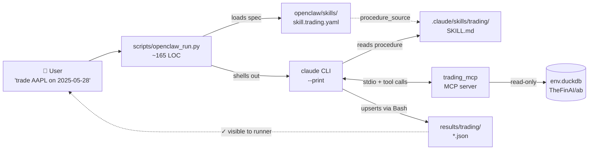

# openclaw — quickstart

A beginner-friendly guide to running the trading-analysis skills through
the **openclaw** YAML harness. If you've already read the main repo
README and just want to know where openclaw fits, jump to
[How is this different from `./run_docker.sh`?](#how-is-this-different-from-run_dockersh).

## What is openclaw?

`openclaw/` is a **machine-readable projection** of the five skills
under `.claude/skills/`. One YAML per skill spells out the routing
triggers, MCP server config, tool signatures, output artifact templates,
and constraints — everything an orchestrator needs to invoke the skill
without having to parse `SKILL.md`.

The Markdown SKILL.md files remain the canonical procedure; each YAML's
`procedure_source` points at its sibling Markdown.



The runner's job is small: load the YAML, format the user prompt,
shell out to `claude --print` with `SKILL.md` as the system prompt, and
report the resulting JSON. The Anthropic SDK's tool-use loop and the
MCP server do all the actual work.

## Demo

One user prompt, end-to-end, in ~110 seconds:


> Prefer MP4? `docs/demo-claude.mp4` is the same content (~125 KB).

The same flow dispatched through `scripts/openclaw_run.py` — the
"openclaw runtime POC":


> MP4: `docs/demo-openclaw.mp4` (~445 KB).

## 60-second quickstart

You need: Python 3.11+, `claude` CLI, the env DuckDB.

```bash
# 1. Clone
git clone https://github.com/xueqingpeng/trading-analysis.git
cd trading-analysis
git checkout claude-agent-sdk

# 2. Install Python deps
pip install -r requirements.txt          # the main repo's requirements
pip install pyyaml                       # only extra dep for openclaw_run.py

# 3. Drop the data file in place
#    (env.duckdb is tracked in the claude-agent-sdk branch ~30 MB)
ls -lh env.duckdb                        # already there after clone

# 4. Auth (claude CLI uses OAuth/keychain by default)
claude auth login                        # one-time, opens browser
#    OR
export ANTHROPIC_API_KEY=sk-ant-…        # alternative: env-var auth

# 5. Run the demo
python3 scripts/openclaw_run.py \
    --symbol AAPL --target-date 2025-05-28
```

You should see:

1. The openclaw banner showing `model = claude-sonnet-4-6`,
   `mcp_servers = ['trading_mcp']`, tool count.
2. A claude session log: tool calls (`is_trading_day`, `get_prices`,
   `list_news`, `get_news_by_id`, `list_filings`, …) streaming in
   real-time as cyan arrows.
3. The model's final text decision (BUY / SELL / HOLD with reasoning).
4. The output line: `output: results/trading/trading_AAPL_openclaw-poc_claude-sonnet-4-6.json`.
5. A summary banner: turns / duration / cost.

If you see all five, you've reproduced the GIF above. ✅

## Step-by-step reproduction (no shortcuts)

### Prerequisites

| Tool | Version | Why |
|---|---|---|
| Python | 3.11 or higher | runs `openclaw_run.py` |
| `claude` CLI | 2.0+ (any recent) | dispatches the agent loop |
| `pyyaml` | 6.0+ | parses skill YAML |
| `duckdb` | 1.0+ | only if you want to inspect `env.duckdb` directly |
| `pandas-ta` | optional | indicator math; the `.claude/skills/<name>/scripts/mcp/<name>_mcp.py` MCP servers `import pandas_ta`. PyPI Python-3.11 wheels are yanked; either upgrade to 3.12 or install from source / use the shim from the original repo |

### Verify env.duckdb is the real data

```bash
python3 -c "
import duckdb
con = duckdb.connect('env.duckdb', read_only=True)
print('symbols:', sorted(r[0] for r in con.execute('SELECT DISTINCT symbol FROM prices').fetchall()))
print('AAPL 2025-05-28:', con.execute(\"SELECT date, adj_close FROM prices WHERE symbol='AAPL' AND date='2025-05-28'\").fetchone())
"
```

Expected: 8 symbols (AAPL, ADBE, AMZN, GOOGL, META, MSFT, NVDA, TSLA),
AAPL 2025-05-28 adj_close ≈ 199.81.

If you get fewer symbols or the row is `None`, your `env.duckdb` is
the synthetic smoke-test seed; re-pull the real one from
HuggingFace `TheFinAI/ab`.

### Validate the YAML chain

```bash
python3 -c "
import yaml, pathlib
for p in sorted(pathlib.Path('openclaw/skills').glob('skill.*.yaml')):
    d = yaml.safe_load(p.read_text())
    src = d['skill'].get('procedure_source','')
    target = (p.parent / src).resolve()
    print(f'{\"OK \" if target.exists() else \"MISS\"} {p.name:36s} -> {src}')"
```

All 5 should print `OK`. If any are `MISS`, you're not on the
`claude-agent-sdk` branch (top-level skills moved to `.claude/skills/`).

### Run it

```bash
python3 scripts/openclaw_run.py \
    --symbol AAPL --target-date 2025-05-28 \
    --max-budget-usd 1.50          # optional safety cap
```

Expected runtime ~90-120s. Expected cost $0.20-0.40 on Sonnet 4.6.

### Inspect the output

```bash
cat results/trading/trading_AAPL_openclaw-poc_claude-sonnet-4-6.json | jq .
```

Schema:
```json
{
  "status": "in_progress",
  "symbol": "AAPL",
  "agent": "openclaw-poc",
  "model": "claude-sonnet-4-6",
  "start_date": "2025-05-28",
  "end_date": "2025-05-28",
  "recommendations": [
    {
      "date": "2025-05-28",
      "price": 199.81195068359375,
      "recommended_action": "HOLD"
    }
  ]
}
```

The action will vary across runs (the model is stochastic). What
matters is the schema and the file location.

## Variations

### Different stock or date

```bash
python3 scripts/openclaw_run.py \
    --symbol NVDA --target-date 2025-05-15
```

Allowed symbols (8): `AAPL ADBE AMZN GOOGL META MSFT NVDA TSLA`.
Allowed date range: 2024-01-02 through 2025-05-30 (the `prices` table
in `env.duckdb`).

### Hedging skill (pair trading)

```bash
python3 scripts/openclaw_run.py \
    --skill openclaw/skills/skill.hedging.yaml \
    --prompt "Start hedging on 2025-03-03 with IS_FIRST_DAY=True. Use agent_name=openclaw-poc and model=claude-sonnet-4-6 for the output filename."
```

The hedging skill picks one ordered pair from the 8-symbol pool on the
run's first day, then trades that fixed pair on subsequent days. Output
lands at `results/hedging/openclaw-poc_hedging_<LEFT>_<RIGHT>_claude-sonnet-4-6.json`.

### Auditing skill (XBRL)

```bash
python3 scripts/openclaw_run.py \
    --skill openclaw/skills/skill.auditing.yaml \
    --prompt "Please audit the value of us-gaap:AssetsCurrent for 2023-01-01 to 2023-12-31 in the 10k filing released by rrr on 2023-12-31. (id: mr_1) Use agent_name=openclaw-poc and model=claude-sonnet-4-6 for the output filename."
```

Auditing reads XBRL XML files under `auditing_env/` (separate data
track from the trading DuckDB — see the main README's auditing
section). Output: a single JSON line at
`results/auditing/openclaw-poc_auditing_10k_rrr_20231231_claude-sonnet-4-6.json`.

### Pure `claude` CLI (no openclaw runner)

The runner is a thin wrapper. If you want to bypass it:

```bash
claude --print --model claude-sonnet-4-6 \
    --append-system-prompt-file .claude/skills/trading/SKILL.md \
    "trade AAPL on 2025-05-28. Use agent_name=demo and model=claude-sonnet-4-6 for the output filename."
```

The `claude` CLI auto-discovers `.claude/skills/<name>/.mcp.json` from
the current directory, so the MCP server starts on its own. This is
exactly what `openclaw_run.py` shells out to internally — the value
the runner adds is loading the YAML, formatting the prompt, and
post-reporting the result file.

## How is this different from `./run_docker.sh`?

The main repo ships a Python benchmark harness in
`claude_agent_trading/` plus `run_docker.sh` for production benchmark
runs. openclaw sits orthogonally:

| | `claude_agent_trading/` runner | `openclaw_run.py` |
|---|---|---|
| **Purpose** | Production benchmark — loops over date ranges, batches, multi-provider routing, Docker integration, log capture | POC dispatcher — one invocation per call, single model, shows the YAML harness is "real" |
| **Driving spec** | Hard-coded Python in `benchmark.py` / `trading_daily.py` / etc. | Declarative YAML at `openclaw/skills/skill.<name>.yaml` |
| **Provider routing** | Has `claude_proxy/` for OpenAI / Gemini / Azure / Foundry | Uses whatever `claude` CLI is auth'd to |
| **Cost** | Designed for hundreds of decisions per run | One decision per invocation |
| **Modify a skill** | Edit Python | Edit YAML |
| **External consumer** | This repo's `run_benchmark.py` | Anyone who wants a YAML spec to drive a Claude Code skill |

You'd use `./run_docker.sh trading --start ... --end ...` for a real
benchmark sweep. You'd use `openclaw_run.py` for ad-hoc single
invocations or to verify the YAML harness works end-to-end.

## Architecture deep-dive

### Layout

```
openclaw/
├── README.md                          ← you are here
├── openclaw.config.example.yaml       ← top-level includes
├── providers/
│   └── provider.claude.yaml           ← Anthropic API: Sonnet 4.6, Opus 4.7, Haiku 4.5
├── routers/
│   └── router.trading-suite.yaml      ← priorities & keyword routing
└── skills/
    ├── skill.trading.yaml             ← 7-tool MCP surface (final_trading)
    ├── skill.hedging.yaml             ← 10-tool surface (final_hedging)
    ├── skill.auditing.yaml            ← XBRL Cases A/B/C/D (final_auditing)
    ├── skill.report-generation.yaml   ← bash-only (report* not yet final)
    └── skill.report-evaluation.yaml   ← bash-only

scripts/
├── openclaw_run.py                    ← the runner (~165 LOC)
└── _stream_format.py                  ← pretty-prints stream-json
```

### What's in a skill YAML

Take `skill.trading.yaml` as the canonical example. Key sections:

| Section | What it declares |
|---|---|
| `skill.{id, display_name, description, procedure_source}` | identity + path to canonical SKILL.md |
| `routing.{positive_triggers, negative_triggers, priority}` | when an orchestrator should auto-invoke this skill |
| `model_selection.preferred_{provider, model}` | what backend to dispatch to |
| `mcp_servers[]` | which MCP server processes to spawn (id, command, args, env) |
| `tools[]` | every tool the skill calls — name, signature, `[preferred]` / `[deprecated]` |
| `scripts[]` | helper CLI scripts the skill invokes via Bash (e.g. `upsert_decision.py`) |
| `input_schema.{required, optional, defaults}` | what callers must supply |
| `output_artifacts[]` | output file path templates and record schemas |
| `constraints{}` | hard rules (no look-ahead, force-HOLD-on-weekend, etc.) |
| `procedure[]` | numbered procedure steps mirroring SKILL.md |
| `prompt_template` | the formatted system / user prompt string |

The runner reads only a small subset of this:
`skill.id`, `skill.procedure_source`, `model_selection.preferred_model`,
`mcp_servers`, `tools` (for the banner). The rest is metadata for an
openclaw engine to consume — not part of this PR.

### Why per-skill MCP servers

trading, hedging, and auditing each declare their own MCP server
(`trading_mcp`, `hedging_mcp`, `auditing_mcp`). Each is a separate
Python file under `.claude/skills/<name>/scripts/mcp/`. This matches
xueqing's claude-agent-sdk layout: every skill is a self-contained
package.

The trade-off is one extra subprocess per skill, in exchange for
clean isolation: tools, schema, helpers, even the data backend can
differ skill-by-skill. trading_mcp + hedging_mcp share `env.duckdb`;
auditing_mcp reads XBRL XML on disk.

## Troubleshooting

### "tool_use_error: Unknown skill: trading"

Your `claude` CLI tried to invoke `/trading` as a slash command but
it isn't registered. `claude` discovers skills from
`.claude/skills/<name>/SKILL.md` relative to **cwd**. Fix: run from
the repo root, not from a subfolder.

### "Claude requested permissions to use mcp__trading_mcp__get_prices"

The inner `claude --print` session is enforcing permission prompts.
Add to `.claude/settings.local.json`:

```json
{
  "permissions": {
    "allow": [
      "mcp__trading_mcp__get_prices",
      "mcp__trading_mcp__get_news",
      "mcp__trading_mcp__get_filings",
      "mcp__trading_mcp__get_indicator",
      "mcp__trading_mcp__get_latest_date",
      "Bash(python3 *)"
    ]
  }
}
```

(Note `.claude/` is gitignored — this file stays local.)

### "Error: result (XXX,XXX characters) exceeds maximum allowed tokens"

A bulk MCP tool returned too much data for the inline-result limit.
Pre-final-trading you'd hit this with `get_news` / `get_filings`. The
final 7-tool surface uses `list_news` + `get_news_by_id` and
`list_filings` + `get_filing_section` to avoid this. If you wrote
custom code that calls a bulk variant, switch to the list/get pair.

### "ModuleNotFoundError: No module named 'pandas_ta'"

PyPI's `pandas-ta` wheels for Python 3.11 are yanked. Three options:

1. Upgrade to Python 3.12.
2. Install from source: `pip install git+https://github.com/twopirllc/pandas-ta`.
3. Drop the 50-line shim alongside `trading_mcp.py`:

```python
# .claude/skills/trading/scripts/mcp/pandas_ta.py
# (see tests/smoke/pandas_ta_shim.py in the original NuoJohnChen fork)
```

### `claude --print` budget exceeded immediately

Default `--max-budget-usd 0.50` is too tight for a full skill loop
(MD&A reads can push past it). Use `--max-budget-usd 1.50`.

## Files added by this harness

```diff
+ openclaw/                                  ← YAML projection
+ openclaw/README.md                         ← this file
+ openclaw/openclaw.config.example.yaml
+ openclaw/providers/provider.claude.yaml
+ openclaw/routers/router.trading-suite.yaml
+ openclaw/skills/skill.{trading,hedging,auditing}.yaml
+ openclaw/skills/skill.{report-generation,report-evaluation}.yaml
+ scripts/openclaw_run.py                    ← ~165 LOC runner
+ scripts/_stream_format.py                  ← pretty-printer
+ docs/demo-claude.{gif,mp4}                 ← 110-second end-to-end demo
+ docs/demo-openclaw.{gif,mp4}               ← runner POC demo
~ README.md                                  ← appended an "openclaw harness + demo" section
```

No file under `.claude/skills/` is modified. The original
`claude_agent_trading/` benchmark harness is untouched.
